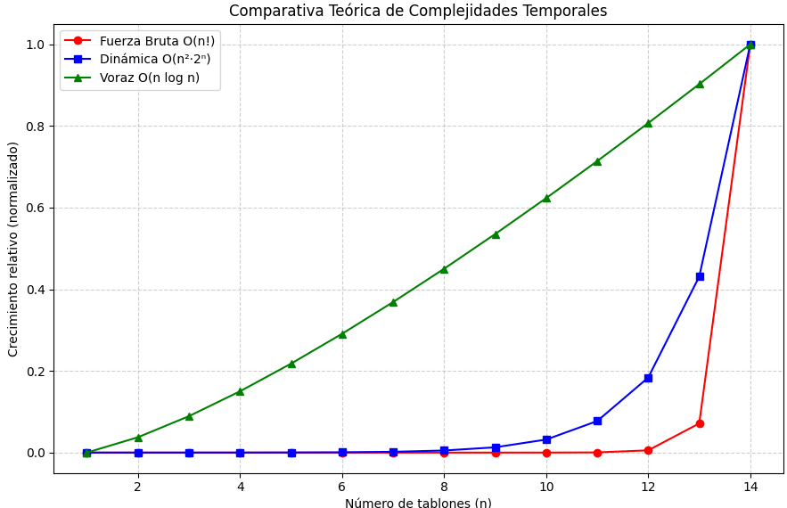

---

# 📊 Informe de Complejidad — Problema del Riego Óptimo

**Curso:** Análisis de Algoritmos II
**Periodo:** 2025-II
**Autor:** Kevin Andrés Bejarano
**Tema:** Comparación de complejidad entre enfoques: Fuerza Bruta, Programación Dinámica y Voraz.

---

## 🌾 0. Descripción del problema

El **problema del riego óptimo** busca determinar el orden en que deben regarse los tablones de una finca para **minimizar el sufrimiento del cultivo por falta de agua**.

Cada tablón (T_i) se define como una tupla ((ts_i, tr_i, p_i)):

* (ts_i): tiempo de supervivencia (días que puede estar sin riego),
* (tr_i): tiempo que tarda en regarse,
* (p_i): prioridad del tablón (1–4, donde 4 es la más alta).

El **costo total** se calcula como:
-ts_i)$]})

donde $$(\Pi)$$ es la permutación que representa el orden de riego.

El objetivo es **encontrar la permutación que minimice** este costo total.

---

## ⚙️ 1. Algoritmo de Fuerza Bruta

### 🔹 Descripción

La solución por **fuerza bruta** explora **todas las permutaciones posibles** del conjunto de tablones, calcula el costo total de riego para cada una usando la función `calcular_costo`, y selecciona la de menor costo.

Pseudocódigo simplificado:

```python
for perm in itertools.permutations(range(n)):
    costo = calcular_costo(finca, perm)
    if costo < mejor_costo:
        mejor_costo = costo
        mejor_perm = perm
```

### ⏱️ Complejidad temporal

El número de permutaciones posibles es (n!).
Para cada permutación se calcula el costo en tiempo (O(n)).

Por tanto:


=O(n\cdot&space;n!)=O(n!)$$]})

**Crecimiento exponencial:** incluso para (n=10), se generan 3.6 millones de permutaciones.

### 💾 Complejidad espacial

* Se mantiene una lista temporal de longitud (n).
* En la versión `roFB_all`, se almacenan todas las permutaciones con su costo → (O(n! \cdot n)).
* En la versión `roFB`, solo la mejor solución → (O(n)).

Por tanto:

=O(n)$$]})
ó $$ $$})si se guardan todas las combinaciones.


### 📈 Resumen

| Aspecto | Complejidad |
| ------- | ----------- |
| Tiempo  | $$ O(n!)$$  |
| Espacio | $$ (O(n))$$ |

La fuerza bruta **garantiza la solución óptima**, pero solo es viable para fincas pequeñas (≤8 tablones).

---

## 🧮 2. Algoritmo de Programación Dinámica

### 🔹 Descripción

El algoritmo de **programación dinámica** implementa un enfoque **Bottom-Up** que guarda resultados de subproblemas en un diccionario `dp`.
Cada estado `dp[S]` (donde `S` es un subconjunto de tablones) representa el costo mínimo al regar los tablones en `S`.

Para cada subconjunto y posible tablón final, se calcula:

)\big)$$})

Esto evita recalcular combinaciones, reutilizando resultados de subconjuntos previos.

### ⏱️ Complejidad temporal

* Número de subconjuntos posibles: (2^n).
* Para cada subconjunto se prueba cada tablón (j), y dentro de eso se busca el mejor previo (i), lo cual cuesta (O(n)).

Por tanto:


Esto reduce drásticamente la complejidad respecto a la fuerza bruta, pero sigue siendo **exponencial**.

### 💾 Complejidad espacial

Cada subconjunto `S` mantiene hasta (n) costos asociados.
En total:
=O(n^2\cdot&space;2^n)$$})
### 📈 Resumen

| Aspecto | Complejidad                                                                              |
| ------- | -----------------------------------------------------------------------------------------|
| Tiempo  |$$})|
| Espacio | $$}) |

Este método logra la **solución óptima** pero con un alto costo de memoria, siendo útil para (n \leq 20).

---

## ⚡ 3. Algoritmo Voraz

### 🔹 Descripción

El método **voraz** implementa una regla **EDD (Earliest Due Date)** modificada por prioridad:
se ordenan los tablones por **tiempo de supervivencia ascendente**, **prioridad descendente**, y **tiempo de riego ascendente**.

```python
pi = sorted(indices, key=lambda i: (ts[i], -p[i], tr[i]))
```

Luego se calcula el costo una única vez con esa secuencia.

### ⏱️ Complejidad temporal

* Ordenamiento de (n) elementos: $$ O(n \log n) $$.
* Cálculo del costo: $$ (O(n)) $$.

Por tanto:
$$ T(n) = O(n \log n) $$

### 💾 Complejidad espacial

* Se almacena una lista con (n) índices y tres arreglos temporales (start, completion, costo).

=O(n)$$})

### 📈 Resumen

| Aspecto | Complejidad                                                                                 |
| ------- | --------------------------------------------------------------------------------------------|
| Tiempo  | $$|})|
| Espacio | $$|})                  |

El enfoque voraz es **muy eficiente**, aunque puede no garantizar el costo mínimo global.

---

## 📊 4. Comparación general

| Método                | Exactitud  | Complejidad Temporal   | Complejidad Espacial | Escalabilidad |
| --------------------- | ---------- | ---------------------- | -------------------- | ------------- |
| Fuerza Bruta          | Óptimo     | $$ O(n!) $$            | $$ O(n)$$            | Muy baja      |
| Programación Dinámica | Óptimo     | $$ O(n^2 2^n) $$       | $$ O(n 2^n) $$       | Media         |
| Voraz                 | Aproximado | (O(n \log n))          | $$ O(n) $$           | Alta          |


Comparacion teorica de complejidades en tiempo y espacio para las tres estrategias implementadas.



---

## 🧠 5. Conclusiones

* **Fuerza Bruta** asegura la solución óptima pero su crecimiento factorial la vuelve inviable a partir de $$(n \ge 9)$$.
* **Programación Dinámica** ofrece una mejora sustancial, manteniendo la optimalidad con un costo exponencial más manejable.
* **Voraz** es la opción más eficiente para fincas grandes, sacrificando exactitud por velocidad.
* En contextos reales (fincas grandes), el algoritmo **voraz** es la mejor opción práctica.

---

